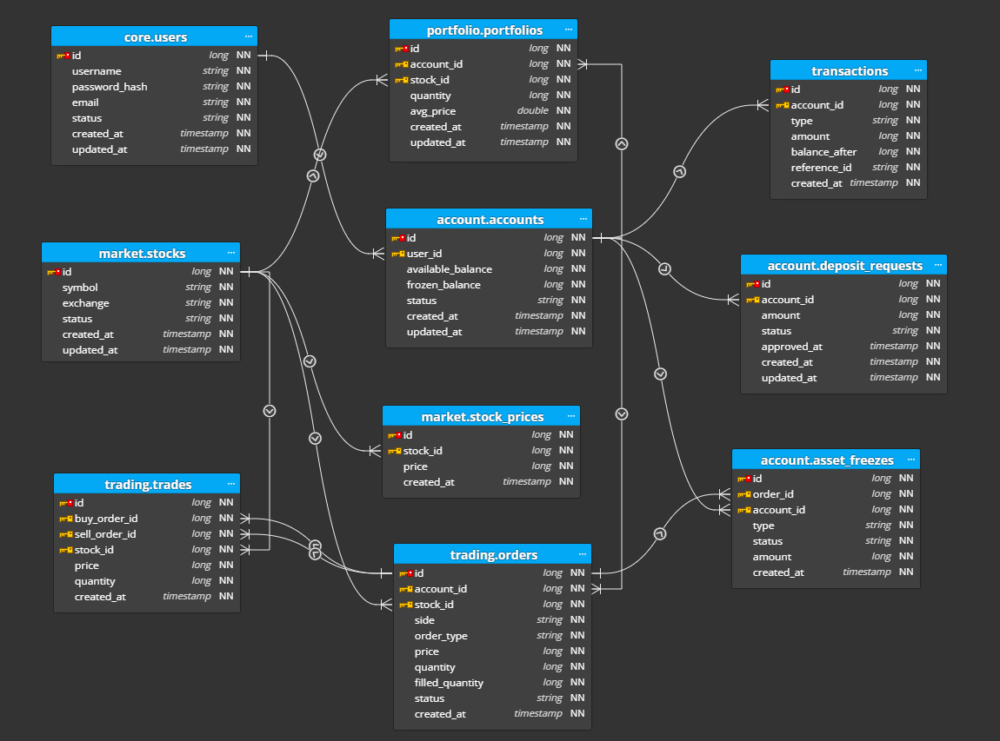

Stock Trading System - Database Documentation
Hệ thống quản lý giao dịch chứng khoán tập trung, hỗ trợ quản lý đa tài khoản, theo dõi thị trường theo thời gian thực và xử lý lệnh giao dịch (Matching Engine) với cơ chế đóng băng tài sản an toàn.

1. Kiến Trúc Tổng Quan (Architecture)
Hệ thống được thiết kế theo mô hình Microservices/Modular Monolith với các phân vùng dữ liệu (Schemas) tách biệt để đảm bảo tính toàn vẹn và khả năng mở rộng:

Core: Định danh và xác thực người dùng.
Market: Dữ liệu bảng điện và lịch sử giá.
Trading: Logic đặt lệnh và khớp lệnh.
Account: Quản lý tiền mặt, nòng cốt của hệ thống Ledger.
Portfolio: Quản lý số dư cổ phiếu và giá vốn.

2. Chi Tiết Thực Thể (Entity Details)
2.1 Quản Lý Người Dùng & Tài Khoản
core.users: Lưu trữ thông tin định danh người dùng cơ bản.

account.accounts: Mỗi người dùng có thể có nhiều tài khoản. Quản lý số dư khả dụng (available_balance) và số dư bị phong tỏa (frozen_balance) để đảm bảo không xảy ra tình trạng "over-spending".

account.deposit_requests: Quản lý luồng nạp tiền từ bên ngoài vào hệ thống.

2.2 Thị Trường (Market Data)
market.stocks: Danh mục các mã chứng khoán (VND, VCB, HPG...) và sàn niêm yết (HOSE, HNX, UPCOM).

market.stock_prices: Lưu trữ lịch sử giá của từng mã theo thời gian để vẽ biểu đồ và tính toán giá trị tài sản ròng (NAV).

2.3 Giao Dịch & Khớp Lệnh
trading.orders: Lưu trữ các lệnh mua/bán của người dùng. Trạng thái lệnh gồm: Pending, Filled, Partially Filled, Canceled.

trading.trades: Kết quả của việc khớp lệnh thành công. Một lệnh (order) lớn có thể dẫn đến nhiều giao dịch (trades) nhỏ.

account.asset_freezes: Lưu vết việc đóng băng tiền (khi đặt lệnh mua) hoặc đóng băng cổ phiếu (khi đặt lệnh bán) cho đến khi lệnh được khớp hoặc hủy.

2.4 Danh Mục Đầu Tư & Nhật Ký
portfolio.portfolios: Quản lý danh mục sở hữu. Sử dụng thuộc tính avg_price (giá vốn bình quân gia quyền) để tính toán lãi/lỗ.

transactions: Nhật ký mọi biến động tài chính của tài khoản (Audit Trail).

3. Quy Trình Nghiệp Vụ Chính (Core Business Workflows)
3.1 Quy trình Đặt Lệnh (Order Placement)
Người dùng chọn mã (stock_id), số lượng (quantity), giá (price) và chiều giao dịch (side: BUY/SELL).

Hệ thống kiểm tra nguồn lực:

Nếu BUY: Kiểm tra available_balance >= quantity * price.

Nếu SELL: Kiểm tra portfolios.quantity >= quantity.

Tạo bản ghi trong trading.orders với trạng thái PENDING.

Tạo bản ghi trong account.asset_freezes và cập nhật frozen_balance của tài khoản/cổ phiếu tương ứng.

3.2 Quy trình Khớp Lệnh (Order Execution)
Khi có sự khớp nhau về giá giữa lệnh Mua và Bán, hệ thống tạo bản ghi trong trading.trades.

Cập nhật số lượng filled_quantity trong trading.orders.

Hạch toán tài sản:

Giảm frozen_balance (số lượng tương ứng phần đã khớp).

Cập nhật portfolio.portfolios: Tăng/Giảm số lượng sở hữu thực tế.

Tính toán lại avg_price cho bên mua.

Ghi nhận vào transactions để phục vụ đối soát.

4. Quy Tắc Ràng Buộc Dữ Liệu (Constraints)
Tính toàn vẹn: Tất cả các bảng đều sử dụng kiểu dữ liệu long cho ID và timestamp cho các trường thời gian.

Tính nhất quán (Atomic): Các thao tác cập nhật số dư tài khoản và tạo giao dịch (trades) phải được thực hiện trong cùng một Database Transaction.

Logic đóng băng: available_balance + frozen_balance = Tổng tài sản của người dùng tại mọi thời điểm.

ERD:
